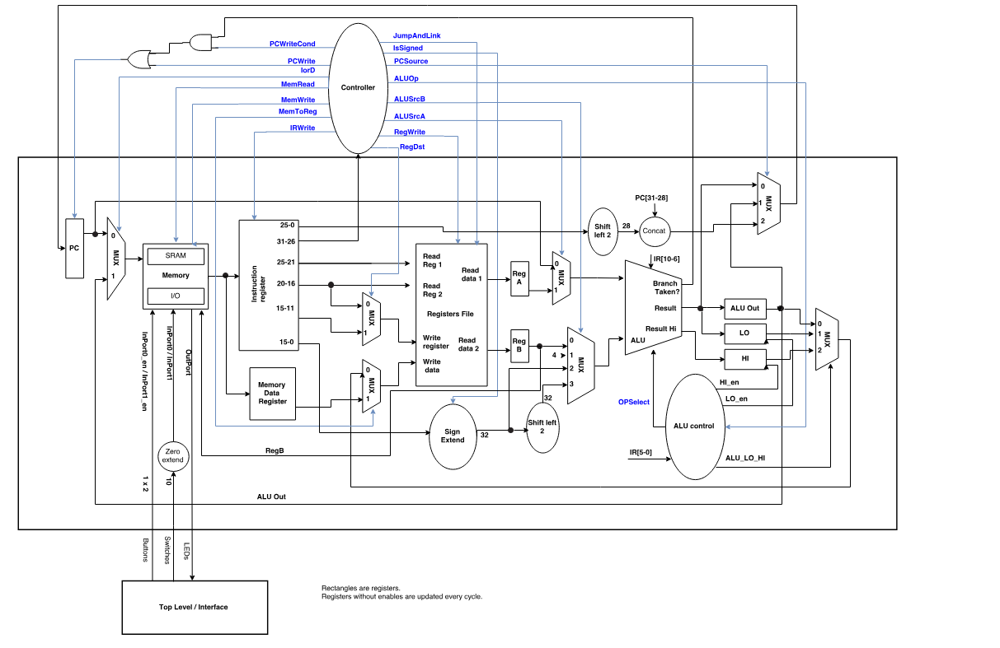
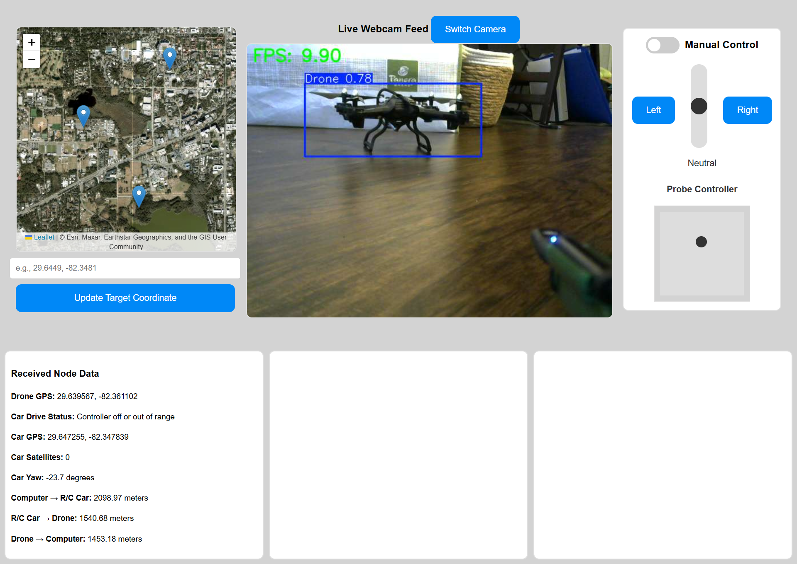

# MIPS Processor (Spring 2025 - October 2025)
My implementation of a MIPS-like 32 bit processor

### Links
- Project Repository: https://github.com/noah-white-8/MIPS

### Processor Architecture

 

# Drone Home (Fall 2024 - Spring 2025)
Modification of a R/C car to make it capable of autonomously navigating to and charging a grounded drone

The Computer Vision functionality was my primary contribution to the project
### Links
- Project Repository: https://github.com/Drone-Home/drone-home-combined.git
- Computer Vision Repository: https://github.com/Drone-Home/OpenCV.git

### User Interface

 

# PDF-GPT (Spring 2024)
Chatbot capable of interacting with PDFs through OpenAI's API

My work primarily consisted of frontend development and working within the Noah-branch of the repository
### Links
- Project Repository: https://github.com/micklerj/PDF-GPT.git 
